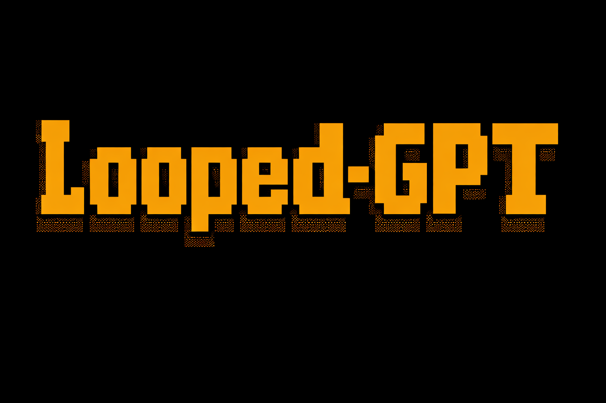

> *Looped-GPT augments a standard GPT architecture with a reverse residual connection that feeds deeper representations back to earlier layers. Across multiple pre-training experiments, looping consistently improves generalization—same-size Looped-GPT models outperform standard baselines at matched step and token budgets, and under a fixed compute budget a 355M Looped-GPT matches a 770M GPT-2.*

---

<p align="left">
  
</p>

**Looped-GPT** is a minimal, lightweight, and highly hackable implementation of **Looped Transformer** built on top of GPT architecture.

**First posted:** January 12, 2026 \
**Updated on:** February 8, 2026

---

## Abstract

Large language models perform all computation in a single forward sweep through their layers. Looped-GPT breaks this constraint with a **reverse residual connection** that feeds the output of the final transformer block back into the input embedding, allowing the model to refine its representations over multiple passes before producing a prediction. In this post, I describe the architecture, walk through the forward and backward pass in pseudocode, and report pre-training results on OpenWebText and FineWeb that show looping improves generalization—even under a matched compute budget.

## Introduction

The standard transformer is a one-shot machine: tokens enter, representations flow forward through $N$ layers, and the language modeling head reads off the final layer. There is no mechanism for the model to revisit its own intermediate conclusions.

Several recent lines of work—Universal Transformers, latent reasoning, test-time compute scaling—suggest that allowing *iterative refinement* of representations is valuable. Looped-GPT explores the simplest version of this idea: add a reverse residual connection so that the deep, refined representations from the last layer are fed back to the beginning, and repeat for $K$ passes.

The result is a model that processes tokens $K$ times with shared weights but progressively better representations—something like an unrolled recurrence without the overhead of separate recurrent weights.

## Method

### Architecture: Reverse Residual Connection

Looped-GPT has a **reverse residual connection** that feeds the output of the final transformer block back into the input embedding. Unlike standard transformer residuals, which operate forward (connecting a module's input to its output, or early layers to deeper ones via highway connections), Looped-GPT reverses this flow: a deeper representation is residually injected into a lower layer.

During training, the model performs $K$ forward passes—$K-1$ refinement steps followed by a final forward pass—and a single backward pass using **backpropagation through depth (BPTD)** without truncation.

<p align="left">
  
  <br>
  <em><strong>Figure 1.</strong> Looped-GPT architecture visualization. The reverse residual connection feeds the final layer's output back into the token embedding before each refinement pass.</em>
</p>

### Forward Pass (Pseudocode)

```
# Input
x = token_embeddings + position_embeddings

# Refinement Phase: (K-1) iterations
for i = 1 to (K-1):
    h = x
    h = TransformerBlocks(h)  # Pass through all N layers
    x = x + h                 # Reverse residual connection

# Final Pass: Kth iteration
h = x
h = TransformerBlocks(h)  # Pass through all N layers
h = LayerNorm(h)
logits = LanguageModelHead(h)

# Total forward passes through transformer: K times
# Total layers processed: K × N (where N = number of transformer blocks)
```

### Backward Pass with Backpropagation through Depth (Pseudocode)

```
# Compute loss gradient
dL/dlogits = LossGradient(logits, targets)

# Gradients flow through all K iterations via reverse residual connection.

# Complexity:
# - Computation Graph: K × Standard GPT
# - Memory Overhead:  K × Standard GPT
```

Note: The algorithm is known as Backpropagation through Time (BPTT) but since we are performing depth-wise recurrence and not time-wise recurrence we call this BPTD. We have not applied any truncation during backprop which means no stop-grad.

## Pre-training Results

### 355M GPT-2 on OpenWebText

We trained a standard GPT-2 model with 355M parameters (**Baseline**) on OpenWebText (9B tokens). The model was trained with an effective batch size of 394K tokens and processed 15.73B tokens in total via data repetition. We then trained two same-size Looped-GPT (355M) variants (**Ours**) with loop steps $K = 2$ and $K = 4$, using the same number of training steps and the same overall token budget.

As shown in Figure 2, GPT models with the looping mechanism achieve higher generalization compared to the baseline, making Looped-GPT more parameter efficient. This experiment is fully reproducible using the given codebase.

<p align="left">
  
  <br>
  <em><strong>Figure 2.</strong> Validation loss vs. training steps for a standard GPT-2 Medium (355M) model (<strong>Baseline</strong>) and same-size Looped-GPT models (<strong>Ours</strong>) with loop steps K = 2 and K = 4. All models are trained on OpenWebText for 40K steps (15.73B tokens) under similar training configurations.</em>
</p>

### 282M LLAMA on FineWeb

We additionally pre-trained a language model with the LLAMA architecture at 282M parameters using a batch size of 131K tokens from the FineWeb education subset with 10B total tokens. We pre-trained a standard LLAMA model (**Baseline**) and a Looped-LLAMA (**Ours**).

In Figure 3, we report total tokens versus training loss. We observe a thematically similar result compared to Figure 2: Looped-LLAMA outperforms the baseline. This experiment is not reproducible using this codebase, as the repository is intentionally kept minimal for simplicity.

<p align="left">
  
  <br>
  <em><strong>Figure 3.</strong> Train loss vs. total tokens (in billions) for a standard LLAMA (282M) model (<strong>Baseline</strong>) and same-size Looped-LLAMA model (<strong>Ours</strong>) with loop steps K = 2. All models are trained on FineWeb for 10B tokens (75K steps) under similar training configurations.</em>
</p>

## Fixed Compute Budget: Is Looped-GPT Compute-Efficient?

Based on discussions on my X **[post](https://x.com/SunnySanyal9/status/2011956392093958623?s=20)** with [Lucas](https://x.com/giffmana) and some other training stalwarts, I decided to run a set of pre-training experiments under a **fixed compute budget** of up to **4 × 10¹⁹ FLOPs**. This budget was chosen to ensure that Looped-GPT can see the full dataset (9B tokens) within the allocated compute. For this setup, we performed a short learning-rate sweep and selected **6e-4**; all other training details remain unchanged.

We pre-trained the following models up to the same FLOPs budget, early-stopping once the budget was reached:

- **GPT-2 Large (770M parameters)**
- **GPT-2 Medium (355M parameters)**
- **Looped-GPT (355M parameters)**

In Figure 4, **Looped-GPT**, despite having the same parameter count as GPT-2 Medium and being trained under matched compute, achieves performance comparable to a model with nearly twice the number of parameters. This highlights Looped-GPT's strong compute and parameter efficiency—under the same FLOPs budget, Looped-GPT can effectively punch above its weight, matching the validation loss of a significantly larger model.

<p align="left">
  
  <br>
  <em><strong>Figure 4.</strong> Validation loss vs. training FLOPs for a standard GPT-2 Large (770M) model (<strong>Baseline</strong>) and Looped-GPT (355M) model (<strong>Ours</strong>) with loop steps K = 4. All models are trained on OpenWebText under a matched compute budget.</em>
</p>

Figure 5 shows a negative result worth being honest about: a standard GPT-2 Medium (355M) trained under the same compute budget but on twice the data outperforms Looped-GPT by a comfortable margin. Even so, these results should spark interest in the modeling and pre-training community—especially for researchers with large-scale compute resources—toward running broader scaling experiments to better understand when looping helps and when data wins.

<p align="left">
  
  <br>
  <em><strong>Figure 5.</strong> Validation loss vs. training FLOPs for a standard GPT-2 Medium (355M) model (<strong>Baseline</strong>) and same-size Looped-GPT models (<strong>Ours</strong>) with loop steps K = 4. The Baseline is trained with 18 billion tokens (~2 epochs) whereas Looped-GPT is trained with 9 billion tokens (~1 epoch). All models trained on OpenWebText under matched compute budget.</em>
</p>

## Intuition: Why Does Looping Lead to Better Generalization?

**Architectural perspective.** The reverse residual connection from deeper layers to early layers provides a unique opportunity to the early transformer blocks. During the looping mechanism, the early blocks process tokens not just with the representations found below them, but also the nuanced representations provided by the deeper layers. This whole process of multiple looping steps can be seen as iterative activation refinement (Figure 1).

**Optimization perspective.** Recall that residual connections act as smoothing operators for [loss landscapes](https://arxiv.org/abs/1712.09913). The standard GPT's loss landscape should be more jagged compared to its Looped counterpart. Hence we can intuitively assume that the Looped-GPT loss landscape is smoother, making optimization easier.

## Reproduce Our Results

### Dependencies

- Python 3.10
- PyTorch 2.5
- datasets
- tiktoken

### Prepare Data

Prepare the [OpenWebText](https://huggingface.co/datasets/openwebtext) data following [nanoGPT](https://github.com/karpathy/nanoGPT/):

```
$ python data/openwebtext/prepare.py
```

### Train Looped-GPT (Single GPU)

```
$ python train.py
```

## Closing Thoughts

### Limitations of this Codebase

- This codebase is not optimized for inference.
- This pre-training approach may require additional compute; however, this is also true for other architectures such as MoEs. If an architecture or training recipe achieves consistently better generalization, it deserves to be studied carefully despite higher compute costs.

> **Summary: Looping during pre-training generalizes better.**
>
> Across our pre-training experiments, looping consistently improves generalization. Same-size 355M Looped-GPT models with K = 2 and K = 4 outperform a standard 355M GPT-2 baseline at matched step and token budgets, and on FineWeb, a 282M Looped-LLAMA similarly beats its baseline. Notably, under a fixed compute budget (~4 × 10¹⁹ FLOPs), Looped-GPT (355M, K = 4) achieves validation loss comparable to a much larger 770M GPT-2, highlighting strong parameter and compute efficiency in this regime.

## References

- [Universal Transformers](https://arxiv.org/abs/1807.03819)
- [Scaling up Test-Time Compute with Latent Reasoning: A Recurrent Depth Approach](https://arxiv.org/abs/2502.05171)
- [Scaling Latent Reasoning via Looped Language Models](https://arxiv.org/abs/2510.25741)
- [Pretraining Language Models to Ponder in Continuous Space](https://arxiv.org/abs/2505.20674)

## Acknowledgements

This codebase is extended following [nanoGPT](https://github.com/karpathy/nanoGPT/).

## Citation

```bibtex
@misc{Looped-GPT,
  author = {Sunny Sanyal},
  title = {Looped-GPT: minimal, lightweight, and highly hackable implementation of Looped Transformers built on top of GPT architecture},
  year = {2026},
  publisher = {GitHub},
  url = {https://github.com/sanyalsunny111/Looped-GPT}
}
```
