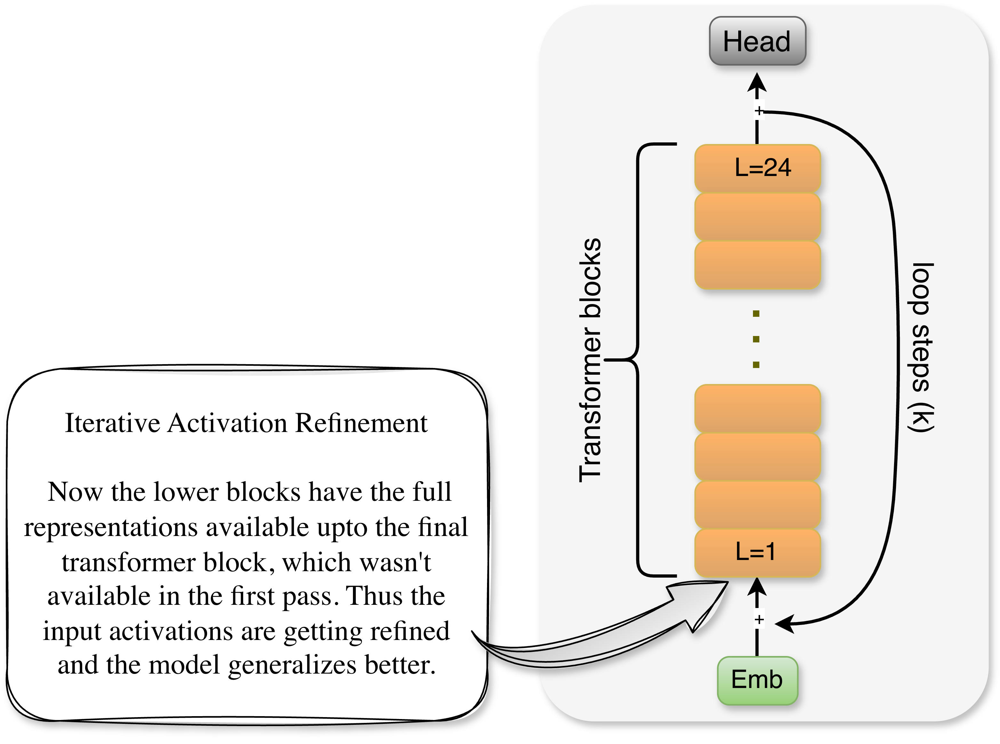
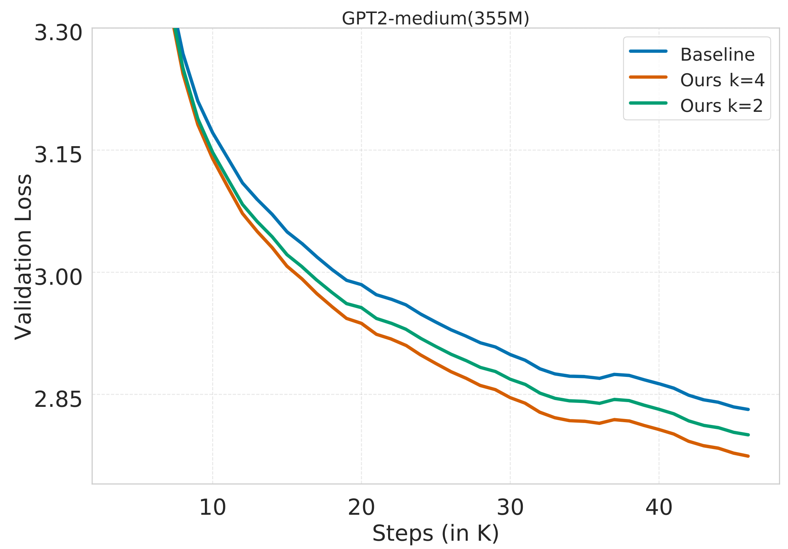
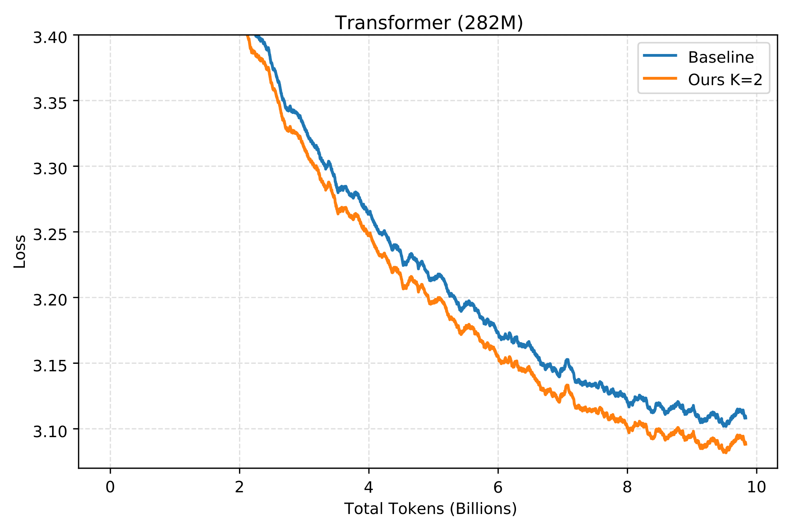
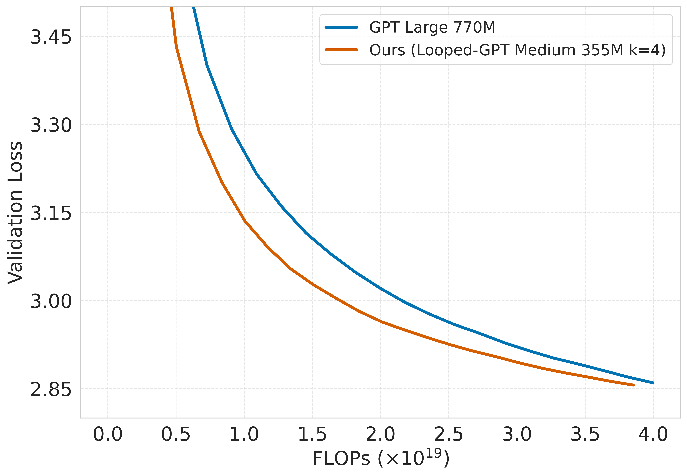
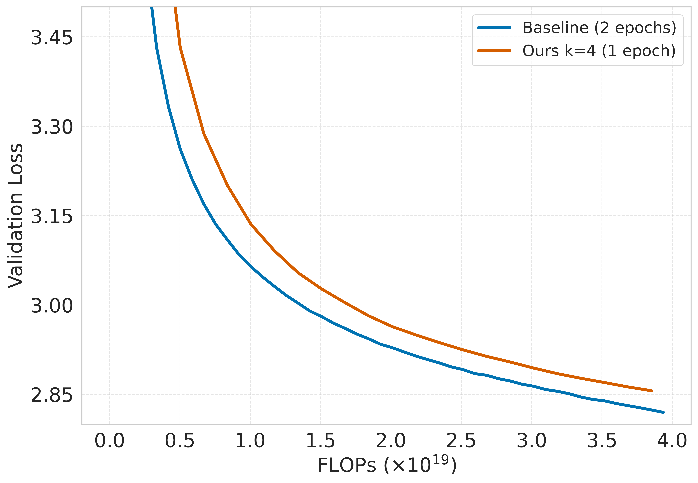

> *Looped-GPT — a language model trained with depth recurrence that enables iterative activation refinement via a reverse residual connection. 
> During pre-training, Looped-GPT outperforms a standard GPT under comparable settings.*
---

## In this Blog

In this post, I introduce **Looped-GPT**, a simple modification to the standard GPT architecture that enables **depth recurrence**. The key idea is a **reverse residual connection** that feeds the representation from the final transformer block back into the input, allowing the model to **iteratively refine its activations over multiple passes**.
I then walk through the architecture, explain the forward and backward passes, and present pre-training experiments on **OpenWebText** and **FineWeb**. Across these experiments, Looped-GPT consistently generalizes better than a standard GPT under a **fixed parameter setting**, and under a **fixed compute budget** it matches or surpasses models with nearly **2× more parameters**.
The goal of this post is to provide a **clear and unified view of the design space for looped transformers**. The current literature is fragmented across many architectural variations; here I focus on a model recipe that is **simple, intuitive, and easy to experiment with**. 
I also provide a **minimal and hackable implementation** ([codebase](https://github.com/sanyalsunny111/Looped-GPT)) of looping in transformers for readers who want to understand the core idea and experiment with it themselves.


## Looped-GPT Pre-Training


<p align="left">
  
  <br>
  <em><strong>Figure 1.</strong> Looped-GPT architecture visualization.</em>
</p>


Looped-GPT has **reverse residual connection** that feeds the output of the final transformer block (layer) back into the input embedding. 
Unlike standard Transformer residuals, which operate in the forward direction by connecting a module's input to its output or 
by connecting early layers to deeper ones via highway connections, Looped-GPT reverses this flow: a deeper representation is 
residually injected into a lower layer. During training, the model performs (K) forward passes i.e. K-1 refinement steps followed by a final forward pass and a single backward pass, 
using **backpropagation through depth (BPTD)** without truncation.


### Forward Pass (Pseudocode)
```
# Input
x = token_embeddings + position_embeddings

# Refinement Phase: (K-1) iterations
for i = 1 to (K-1):
    h = x
    h = TransformerBlocks(h)  # Pass through all N layers
    x = x + h  # Reverse Residual connection

# Final Pass: Kth iteration
h = x
h = TransformerBlocks(h)  # Pass through all N layers
h = LayerNorm(h)
logits = LanguageModelHead(h)

# Total forward passes through transformer: K times
# Total layers processed: K × N (where N = number of transformer blocks)
```


### Backward Pass with Backpropagation through Depth (Pseudocode) 
```
# Compute loss gradient
dL/dlogits = LossGradient(logits, targets)

Gradients flow through all K iterations via reverse residual connection.

# Complexity:
# - Computation Graph: K × Standard GPT
# - Memory Overhead:  K × Standard GPT
```
Note: The algorithm is known as Backpropagation through Time (BPTT) but since we are performing depth-wise 
recurrence and not timewise recurrence we call this BPTD. We have not applied any truncation during backprop which means no stop-grad.

---

## Pre-training Results (355M GPT2 model with OpenWebText)

We trained a standard GPT-2 model with 355M parameters (**Baseline**) on OpenWebText which has 9B tokens. 
The model was trained with an effective batch size of 394K tokens and processed 15.73B tokens in total via data repetition. 
We then trained two same-size Looped-GPT (355M) variants (**Ours**) with loop steps \(K = 2\) and \(K = 4\), using the same number of training steps 
and the same overall token budget. Refer Figure 2 below, it can be seen that GPT models (**Ours**) with looping mechanism achieves 
higher generalization compared to the baseline. This makes (**Ours**) Looped-GPT more parameter efficient compared to the **Baseline**. This experiment is fully reproducible using the given codebase.

<p align="left">
  
  <br>
  <em><strong>Figure 2.</strong> Validation loss vs. training steps for a standard GPT-2 Medium (355M) model (<strong>Baseline</strong>) and same-size Looped-GPT models (<strong>Ours</strong>) with loop steps K = 2 and K = 4. 
All models are trained on OpenWebText for 40K steps (15.73B tokens) under similar training configurations.</em>
</p>

## Pre-training Results (282M LLAMA with Fineweb)

We additionally pre-trained a language model with the LLAMA architecture at 282M parameters. 
We used a batch size of 131K tokens from the FineWeb education subset with 10B total tokens. 
We pre-trained a standard LLAMA model (**Baseline**) and a Looped-LLAMA (**Ours**). 
In **Figure 3**, we report total tokens versus training loss. We observe a thematically similar result (compared to Figure 2), 
where Looped-LLAMA outperforms the baseline. This experiment is not reproducible using this codebase, as the repository is intentionally kept minimal for simplicity.

<p align="left">
  
  <br>
  <em><strong>Figure 3.</strong> Train loss vs. total tokens (in billions) for a standard LLAMA (282M) model (<strong>Baseline</strong>) and same-size Looped-LLAMA model (<strong>Ours</strong>) with loop steps K = 2. 
All models are trained on Fineweb for 10B tokens (75K steps) under similar training configurations.</em>
</p>

---

## Pre-training with Fixed Compute Budget: Is Looped-GPT Compute-Efficient?

Based on discussions on my X **[post](https://x.com/SunnySanyal9/status/2011956392093958623?s=20)** with [Lucas](https://x.com/giffmana) and some other training stalwarts, I decided to run a set of pre-training experiments under a **fixed compute budget** 
of upto **4 × 10¹⁹ FLOPs**. This budget was chosen to ensure that **Looped-GPT can see the full dataset**, i.e., **9B tokens**, 
within the allocated compute. For this setup, we performed a short learning-rate sweep and selected **6e-4** for our model,
rest of the training details remain unchanged.

We then pre-trained the following models up to the same FLOPs budget, early-stopping once the budget was reached:

- **GPT-2 Large (770M parameters)**
- **GPT-2 Medium (355M parameters)**
- **Looped-GPT (355M parameters)**

### Results

In **Figure 4**, we observe that **Looped-GPT**, despite having the **same parameter count** as GPT-2 Medium and being trained under **matched compute**, achieves performance comparable to a model with **nearly twice the number of parameters**. 
This highlights Looped-GPT's strong **compute and parameter efficiency**. In other words, under the same FLOPs budget, Looped-GPT can effectively punch above its weight, matching the validation loss of a significantly larger model.

<p align="left">
  
  <br>
  <em><strong>Figure 4.</strong>Validation loss vs. training FLOPs for a standard GPT-2 Large (770M) model (<strong>Baseline</strong>) 
and Looped-GPT (355M) model (<strong>Ours</strong>) with loop steps (<strong>K = 4</strong>). All models are trained on OpenWebText under matched compute budget.</em>
</p>

In **Figure 5**, we observe a negative result: a standard GPT-2 Medium (355M), trained under the same compute budget but on twice the data, outperforms Looped-GPT by a comfortable margin. 
Even so, these results should spark interest in the modeling and pre-training community especially for researchers with large-scale compute resources toward running broader scaling experiments to better understand when looping helps and when data wins.

<p align="left">
  
  <br>
  <em><strong>Figure 5.</strong> Validation loss vs. training FLOPs for a standard GPT-2 Medium (355M) model (<strong>Baseline</strong>) and same-size Looped-GPT models (<strong>Ours</strong>) with loop steps (<strong>K = 4</strong>). 
The Baseline is trained with 18 billion tokens (~2 epochs) whereas Looped-GPT is trained with 9 billion tokens (~1 epoch). 
All models are trained on OpenWebText under matched compute budget.</em>
</p>


## Intuition: Why Looping leads to better generalization?

- **Architectural perspective :** The reverse residual connection from deeper layers to early layers provides a unique opportunity to the early transformer blocks. 
During the looping mechanism, the early blocks process the tokens not just with the representations found below them, 
but also the nuanced representations provided by the deeper layers. This whole process of multiple looping steps can be seen has iterative activation refinement (Refer Figure 1).

- **Optimization perspective :** Recall residual connections acts as smoothing operators for the [loss landscapes](https://arxiv.org/abs/1712.09913). 
The standard GPT's loss landscape should be more jacked up compared it's Looped counterpart. Hence we can intuitively assume that loss landscape should be less jacked up compared to
standard GPT.


## Closing Thoughts

### Limitation of Looped-GPT

- This pre-training approach may require additional compute; however, this is also true for other architectures such as MoEs. If an architecture or training recipe achieves consistently better generalization, it deserves 
to be studied carefully despite higher compute costs.

<div style="border-left: 4px solid #60a5fa; background: #eff6ff; color: #111827; padding: 14px 16px; border-radius: 8px; margin: 1em 0;">
  <strong style="color: #0f172a;">Summary: Looping during pre-training generalizes better</strong>
  <p style="margin-top: 10px; margin-bottom: 10px; color: #111827;">
    Across our pre-training experiments, looping consistently improves generalization. Same-size <strong style="color: #0f172a;">355M Looped-GPT</strong> models with <strong style="color: #0f172a;">K = 2</strong> and <strong style="color: #0f172a;">K = 4</strong> outperform a standard <strong style="color: #0f172a;">355M GPT-2</strong> baseline at matched step and token budgets, and on <strong style="color: #0f172a;">FineWeb</strong>, a <strong style="color: #0f172a;">282M Looped-LLAMA</strong> similarly beats its baseline.
  </p>
  <p style="margin-top: 10px; margin-bottom: 0; color: #111827;">
    Notably, under a fixed compute budget (~<strong style="color: #0f172a;">4 × 10¹⁹ FLOPs</strong>), <strong style="color: #0f172a;">Looped-GPT (355M, K = 4)</strong> achieves validation loss comparable to a much larger <strong style="color: #0f172a;">770M GPT-2</strong>, highlighting strong <strong style="color: #0f172a;">parameter and compute efficiency</strong> in this regime.
  </p>
</div>


## Code

The code is available at this [repository](https://github.com/sanyalsunny111/Looped-GPT).

---

## References (Extended Reading)

- [Universal Transformers](https://arxiv.org/abs/1807.03819)
- [Scaling up Test-Time Compute with Latent Reasoning: A Recurrent Depth Approach
](https://arxiv.org/abs/2502.05171)
- [Scaling Latent Reasoning via Looped Language Models](https://arxiv.org/abs/2510.25741)
- [Pretraining Language Models to Ponder in Continuous Space](https://arxiv.org/abs/2505.20674)


## Citation

```bibtex
@misc{sanyal2026@Looped-GPT,
  author = {Sunny Sanyal},
  title = {Looped-GPT: Looping During Pre-training improves Generalization},
  year = {2026},
  publisher = {GitHub},
  url = {https://sanyalsunny111.github.io/posts/2026-01-15-post1-looped-gpt/}
}
```