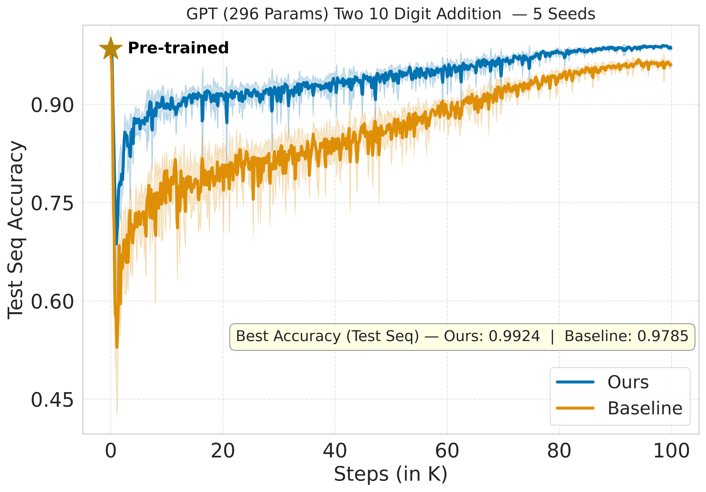

> *A 296-parameter GPT learns to add 10-digit numbers not by changing the architecture, but by changing the training recipe.*

---

## Abstract

Can a transformer with fewer than 300 parameters reliably solve 10-digit addition? 
The answer turns out to be yes if you train it right. This post describes `AdditionGPT`, a minimal causal transformer that treats digit-wise addition as a sequence classification task. 
The key insight is that the architecture need not change at all: a two-stage training recipe, curriculum-style pre-training on variable-length addition, followed by fine-tuning with Latest Weight Averaging (LAWA) is sufficient for a sub-300-parameter GPT to achieve 99% test accuracy on 10-digit addition.


## Personal Story and Anthropomorphizing Model Training

I was leetcode-maxing for my job search, but I broke my own vow and took a break from my regular routine. In my research I usually work on methods that *scale*, but this challenge gave me an opportunity to think about “un-scaling,” which turned out to be pretty interesting too. This post by Dimitris Papailiopoulos ([link](https://x.com/DimitrisPapail/status/2027059284102553707?s=20)) piqued my interest. He started a game and put up an open challenge: find the smallest transformer that can do 10-digit addition. Naturally, everyone (including me) jumped into searching for smaller transformer-based architectures. After a few experiments, I realized architecture alone might not be the right way to think about this problem.

Take a 4-year-old kid learning addition for the first time. A good teacher would start with 2-digit addition and only gradually introduce 10-digit addition. I know that, for most ML researchers, this kind of argument and anthropomorphizing machine learning can sound ridiculous. But last year I had a distinct opportunity to work with and talk to widely respected cognitive science and ML researchers, and those interactions have heavily influenced how I now think about model training. I’ve also been told that Prof. Hinton, at one point, considered himself a cognitive scientist. At this point I’m at least convinced of a softer claim: machines may not learn the same way humans do, but using intuitions from human learning and cognitive science is not a terrible way to think about how to train models.

Sorry for the detour. To solve the problem at hand I have fixed the architecture to a GPT with 296 parameters and did not bother trying to make it even smaller. I decided to go with a training recipe with some sort of 
curriculum.

## Why Curriculum? A Compositional View of Addition

Ten-digit addition looks like one task, but it isn't. It's a *compositional* task; a chain of simple operations glued together by a hidden state that the model never directly observes (the **carry**).

Let's make this more concrete. Write two $k$-digit numbers with digits indexed from least significant:

$$X = (x_1, x_2, \dots, x_k), \qquad Y = (y_1, y_2, \dots, y_k).$$

At each position $i$, the model must compute:

$$z_i = (x_i + y_i + c_{i-1}) \bmod 10, \qquad c_i = \left\lfloor \frac{x_i + y_i + c_{i-1}}{10} \right\rfloor,$$

where $c_0 = 0$ and $z_{k+1} = c_k$ is the final carry-out. The full addition $\mathcal{F}_k$ is just this local operation $h$ composed $k$ times in sequence. Easy for humans. Surprisingly hard for a tiny transformer trained end-to-end.

### The Problem with Training Directly on 10-Digit Addition

Here's the issue. When we train on 10-digit examples from scratch, the loss tells the model "*you got $z_{10}$ wrong*", but it says nothing about *why* (the intermediate steps). Was the error caused by a bad carry at position 1? Position 5? Position 9? The answer is buried inside the carry chain $c_1 \to c_2 \to \cdots \to c_9$, which the model must learn implicitly from input-output pairs alone.

For random inputs, whether $c_i = 1$ or $c_i = 0$ is roughly a coin flip at each position (not exactly for lack of better analogy). So the statistical correlation between, say, $(x_1, y_1)$ and the output digit $z_{10}$ passes through ~9 such coin flips, making the signal exponentially weak in the number of digits.

Wang et al. (2025) [1] formalize a similar phenomenon for compositional tasks. Their **Theorem 2** proves a Statistical Query (SQ) lower bound: any learner that only sees $k$-fold composition outputs needs either **sample size or compute exponential in $k$**. 
Analogously the carry chain in addition has the same structure each step's hidden state ($c_i$) plays the role of the hidden permutations $(\pi_i)$ in their framework.

### Breaking Down the Curriculum

Now consider what happens if we first train on 2-digit addition, then 3-digit, and so on up to 10.

Define the $r$-digit subtask $\mathcal{F}_r$ as: given $(x_1, \dots, x_r)$ and $(y_1, \dots, y_r)$, output the $(r+1)$-digit sum. Two things make this decomposition clean:

1. **Prefix consistency.** The first $r$ output digits of $\mathcal{F}_r$ are identical to the first $r$ digits of the full 10-digit sum. The model isn't learning something different — it's learning a prefix of the same computation.

2. **Carry extraction.** The top digit of $\mathcal{F}_r$'s output is exactly $c_r$ — the carry into position $r+1$. So mastering $r$-digit addition is equivalent to reliably computing the hidden state up to position $r$.

Once the model can compute $c_{r-1}$, learning $\mathcal{F}_r$ reduces to learning one more step of:

$$z_r = (x_r + y_r + c_{r-1}) \bmod 10.$$

This is a function of just three bounded inputs with constant complexity regardless of $k$. The exponential blowup is gone.

**Remark:** Wang et al. proved this rigorously. Their **Theorem 3** shows that with a curriculum of increasing difficulty, gradient descent on an $O(\log k)$-depth transformer learns $k$-fold composition in $\mathrm{poly}(N, k)$ samples i.e. removing the exponential dependence entirely. 
Their **Theorem 4** further shows that even a **data mixture** (training on all difficulties simultaneously, which is closer to what we do) induces an *implicit* curriculum with efficiency guarantee. The easy examples get learned first, which bootstraps learning of the harder ones.


In our setup, pretraining samples sequence lengths almost uniformly from $\{2, 3, \dots, 10\}$. This is the data mixture strategy: the model sees easy and hard examples together, and the training dynamics naturally learn the short additions first (they have stronger gradient signal), which scaffolds learning of longer ones.
The architecture never changes. The 296-parameter GPT is the same model in both stages. What changes is the *distribution of training data* and that's enough to go from a problem that's exponentially hard to one that's tractable.


## Model Architecture

`AdditionGPT` is a minimal causal transformer that treats digit-wise addition as a sequence classification task.

**Input format:** Each addition example is a sequence of length `T = seq_len + 1 = 11`. At each position `t`, the model receives a pair `(a_t, b_t)` of input digits (0–9), normalized as `x / 9 - 0.5`. The final position carries the output carry digit.

**Architecture:**

```
Input (B, T, 2)
   → Linear input projection  (2 → d)
   → + Positional Embedding   (T × d)
   → Transformer Block × L:
        LayerNorm → CausalSelfAttention → residual
        LayerNorm → MLP (GELU, 4× expand) → residual
   → Final LayerNorm
   → Output head (d → 10)     [digit logits, cross-entropy loss]
```

**Config (default):** `d = n_embd = 4`, `n_head = 2`, `n_layer = 1`, `block_size = 11`, `bias = False`, `dropout = 0.0`

**Parameter breakdown (296 total):**

| Component            | Shape      | Params  |
|----------------------|------------|---------|
| Input projection     | 2 × 4      | 8       |
| Positional embedding | 11 × 4     | 44      |
| First LN             | 4          | 4       |
| Attention QKV        | 4 × 12     | 48      |
| Attention out proj   | 4 × 4      | 16      |
| Second LN            | 4          | 4       |
| MLP                  | 4 × 16     | 64      |
| MLP projection       | 16 × 4     | 64      |
| Final LN             | 4          | 4       |
| Output head          | 4 × 10     | 40      |
| **Total**            |            | **296** |

## Training Recipe

### Stage 1 — Curriculum Pre-training

Pre-training uses variable-length addition examples (2 to 10 digits). This acts as curriculum learning—the model first learns short, easy additions before encountering the full 10-digit task.

- **Dataset:** 10k train / 10k test samples; sequence length sampled uniformly from `[2, 10]`; sequences padded to `max_len + 1 = 11` with a binary mask applied to the loss
- **Objective:** Masked cross-entropy loss (only valid digit positions contribute)
- **Optimizer:** AdamW, `max_lr = 8e-3`, `min_lr = 8e-4`
- **Schedule:** 1000-step linear warmup → cosine decay over 100k steps
- **Gradient clipping:** norm = 1.0

### Stage 2 — Fine-tuning with LAWA

Fine-tuning specialises the pre-trained model on fixed 10-digit addition, using **LAWA (Latest Weight Averaging)** to stabilise training.

- **Dataset:** 10k train / 10k test samples of exactly 10-digit addition
- **Optimizer:** AdamW, same LR schedule as pre-training (100k steps)
- **LAWA:** Every 2000 steps a weight snapshot is pushed onto a rolling buffer of size `k = 5`; the averaged model is evaluated alongside the live model

The motivation for LAWA [2] here is simple: at the fine-tuning stage, the training loss oscillates more than it did during curriculum pre-training. Averaging recent weight snapshots smooths over these oscillations and reliably pushes test accuracy higher than any single checkpoint.

## Results

Despite having only 296 parameters, the GPT model reliably learns 10-digit addition end-to-end. A curriculum based pretraining stage followed by fine-tuning is sufficient for a sub-300-parameter GPT to solve the task.

<p align="left">
  
  <br>
  <em><strong>Figure 1.</strong> Test accuracy (10-digit sequence) vs. training steps for a standard 296-parameter GPT model. Without altering the architecture, we modify only the training recipe: the model is pretrained using a curriculum from 2-digit to 10-digit addition and subsequently fine-tuned on the 10-digit task, achieving 99% accuracy.</em>
</p>


## Closing Thoughts

The main takeaway is that **training recipes** matter. Even when the architecture is fixed and tiny, changing how the model sees the data can make the difference between failing and reliably generalizing. In large LLMs, scale can sometimes hide an inefficient learning process; in constrained settings like this one, the recipe is often the whole game. 
Here, a simple curriculum (short-to-long addition) plus LAWA during fine-tuning was enough to push a 296-parameter GPT to reliably learn  two 10-digit addition with a 99% accuracy without any fancy architectural changes.

## Code

The code, logs and checkpoints are available at this [repository](https://github.com/sanyalsunny111/Smallest-GPT-for-addition).

## Contributions

Sunny Sanyal conceived the idea of curriculum-based pretraining combined with LAWA (Latest Weight Averaging) during fine-tuning, and ran all experiments himself. 
Claude wrote all code and also helped in writing.

## References

1. **Learning Compositional Functions with Transformers from Easy-to-Hard Data** ([arXiv:2505.23683](https://arxiv.org/abs/2505.23683)).
   Zixuan Wang, Eshaan Nichani, Alberto Bietti, Alex Damian, Daniel Hsu, Jason D. Lee, Denny Wu.
   *NeurIPS 2025.*


2. **Early Weight Averaging meets High Learning Rates for LLM Pre-training** ([arXiv:2306.03241](https://arxiv.org/abs/2306.03241)).
   Sunny Sanyal, Atula Neerkaje, Jean Kaddour, Abhishek Kumar, Sujay Sanghavi.
   *COLM 2024.*


## Citation

```bibtex
@misc{sanyal2026AdditionGPT,
  author       = {Sunny Sanyal},
  title        = {Curriculum Pretraining Enables 10-Digit Addition for a 296-Parameter GPT with 99% Accuracy},
  year         = {2026},
  note         = {Blog},
  url          = {https://sanyalsunny111.github.io/posts/2026-02-27-smallest-gpt-for-addition/}
}
```
